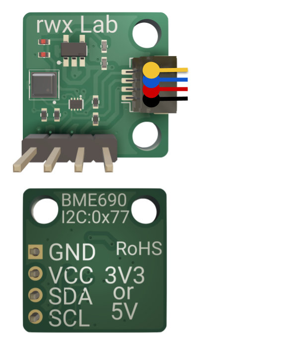

# 🌱 BME690 Breakout Board

This breakout board is based on the [Bosch BME690](https://www.bosch-sensortec.com/products/environmental-sensors/gas-sensors/bme690/#description) — a compact environmental sensor for simultaneously measuring gas, temperature, humidity, and air pressure.

---

## 📊 Technical Data

| Parameter         | Technical Data               |
|-------------------|------------------------------|
| Sensor            | Bosch BME690                 |
| Dimensions        | 17 mm × 17 mm × 5 mm         |
| Supply Voltage    | 3.3 V or 5 V                 |
| Signal Voltage    | 3.3 V / 5 V tolerant         |
| Interface         | I²C (address: 0x77)          |

🔗 For more sensor details, refer to the [BME690 product page](https://www.bosch-sensortec.com/products/environmental-sensors/gas-sensors/bme690/#description).

## 🔌 Pinout (I²C)

| Label | Function        | Voltage Level        |
|-------|------------------|----------------------|
| GND   | Ground           | –                    |
| VCC   | Supply Voltage   | 3.3 V or 5 V         |
| SDA   | I²C Data         | 3.3 V / 5 V tolerant |
| SCL   | I²C Clock        | 3.3 V / 5 V tolerant |

*Note: Pinout follows the Qwiic/Stemma QT standard (JST PH, 4-pin).*

## 💻 Software & Examples

Bosch provides software on their [BME688 and BME690 software page](https://www.bosch-sensortec.com/software-tools/software/bme688-and-bme690-software/).

They also provide a [BME690 Sensor API](https://github.com/boschsensortec/BME690_SensorAPI) on GitHub.

## 🛒 Where to Buy

Looking to get your hands on the BME690 Breakout Board?

You can find it here: [Buy on Tindie](https://www.tindie.com/products/rwx_lab/bme690-breakout-board/)

🔗 For more details and purchase options, check out the [Official Product Page](https://www.rwx-lab.dev/boards/bme690-breakout-board).

